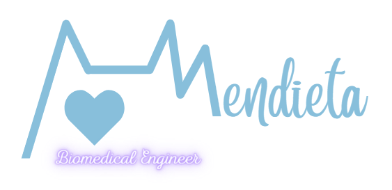

  
   

  <h3><b>Portfolio</b></h3>

# 📗 Table of Contents

- [📖 About the Project](#about-project)
  - [🛠 Built With](#built-with)
    - [Tech Stack](#tech-stack)
    - [Key Features](#key-features)
  - [🚀 Live Demo](#live-demo)
- [💻 Getting Started](#getting-started)
  - [Setup](#setup)
  - [Prerequisites](#prerequisites)
  - [Install](#install)
- [👥 Authors](#authors)
- [🔭 Future Features](#future-features)
- [🤝 Contributing](#contributing)
- [⭐️ Show your support](#support)
- [🙏 Acknowledgements](#acknowledgements)
- [❓ FAQ (OPTIONAL)](#faq)
- [📝 License](#license)

# 📖 Portfolio 

This is a tool to present myself as a software developer.

## 🛠 Built With 

HTML and CSS

### Tech Stack 

  <ul>
    <li><a href="https://developer.mozilla.org/en-US/docs/Web/HTML">HTML</a></li>
    <li><a href = "https://developer.mozilla.org/en-US/docs/Web/CSS">CSS3</a></li>
    <li><a href = "https://developer.mozilla.org/en-US/docs/Learn/CSS/CSS_layout/Flexbox">Flexbox</a></li>
  </ul>

### Key Features 

-My description

(<a href="#readme-top">back to top</a>)

## 🚀 Live Demo 

-No live demo required

(<a href="#readme-top">back to top</a>)

## 💻 Getting Started 

To get a local copy up and running, follow these steps.

### Prerequisites

In order to run this project you need:
-GitHub
-HTML
-Css

### Setup

Clone this repository to your desired folder:

  cd my-folder
  git clone git@github.com: https://github.com/AleMdta/portfolio-mobile-version.git

## 👥 Authors 

👤 Alejandra Mendieta

- GitHub: [@AleMdta](https://github.com/AleMdta)
- Twitter: [@AleMdta](https://twitter.com/AleMdta)
- LinkedIn: [Alejandra Mendieta](https://www.linkedin.com/in/alejandra-mendieta-75480626a)

## 🔭 Future Features 

- [ ] Projects section
- [ ] Skills section
- [ ] Contact section

(<a href="#readme-top">back to top</a>)

## 🤝 Contributing 

Contributions, issues, and feature requests are welcome!

## ⭐️ Show your support 

>
If you like this project wait to see more. ;)

(<a href="ale.mendieta.ingbiomedica@gmail.com">back to top</a>)

## 🙏 Acknowledgments 

I would like to thank Microverse for giving the oportunity to learn.

## 📝 License 

This project is [MIT](./MIT.md) licensed.

(<a href="#readme-top">back to top</a>)
